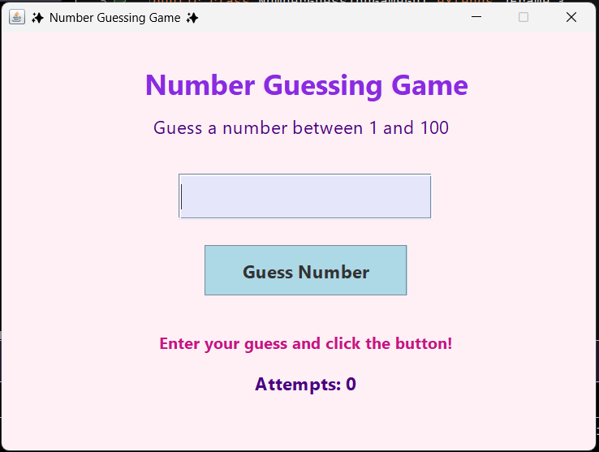
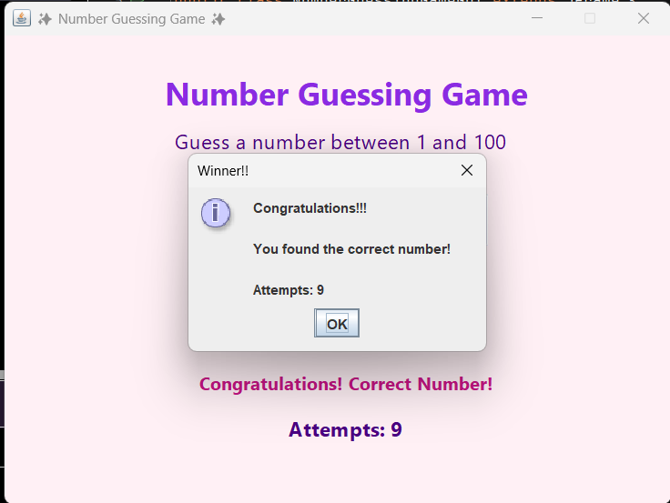
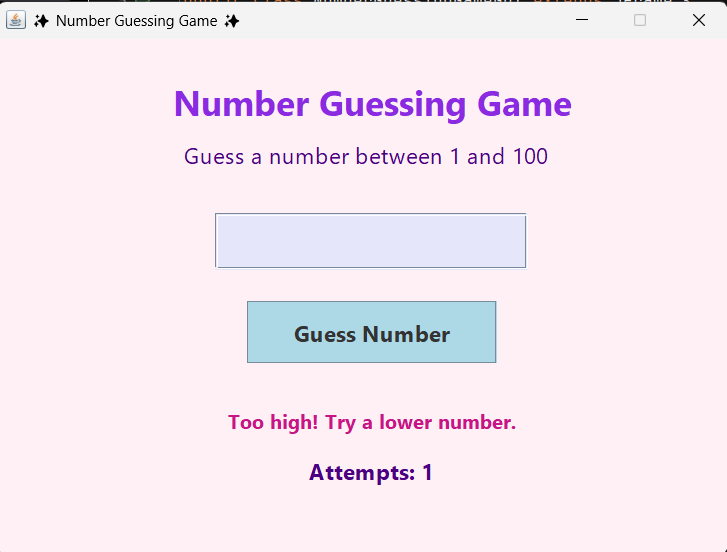

# Number Guessing Game GUI

## Task 02 - Number Guessing Game

This project is a Java Swing-based Number Guessing Game that generates a random number and challenges the user to guess it through an interactive graphical user interface.

### Features
- Random number generation (1-100)
- Interactive GUI using Java Swing
- Real-time feedback (Too High / Too Low)
- Attempts counter
- Input validation
- New Game functionality
- User-friendly interface

## How to Run

### Compile
```bash
javac NumberGuessingGameGUI.java
```

### Execute
```bash
java NumberGuessingGameGUI
```

## How It Works

1. The application generates a random number between 1 and 100.
2. The user enters a guess.
3. The program compares the guess with the generated number.
4. Feedback is displayed:
   - Too High
   - Too Low
   - Correct Guess
5. The number of attempts is tracked until the user guesses correctly.

## Example

### Input
```

Guess: 75

```

### Output
```

Too High! Try Again.

```

### Input
```

Guess: 42

```

### Output
```

Congratulations! You guessed the number in 5 attempts.

```

## Screenshots

### Main Interface


### Correct Guess


### Too High / Too Low Message


## Technologies Used

- Java
- Java Swing
- Object-Oriented Programming (OOP)

## Concepts Learned

- GUI Development using Swing
- Event Handling with ActionListeners
- Random Number Generation
- Input Validation
- User Interaction Design
- Java Programming Fundamentals

## Author

**Manpreet Kaur**

Software Development Intern @ SkillCraft Technology
